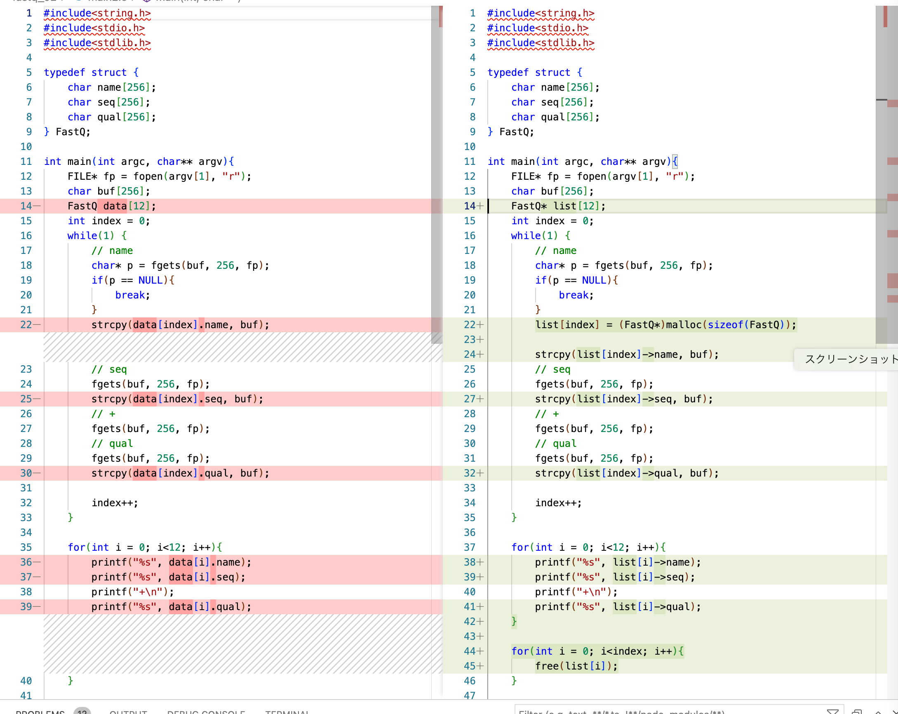
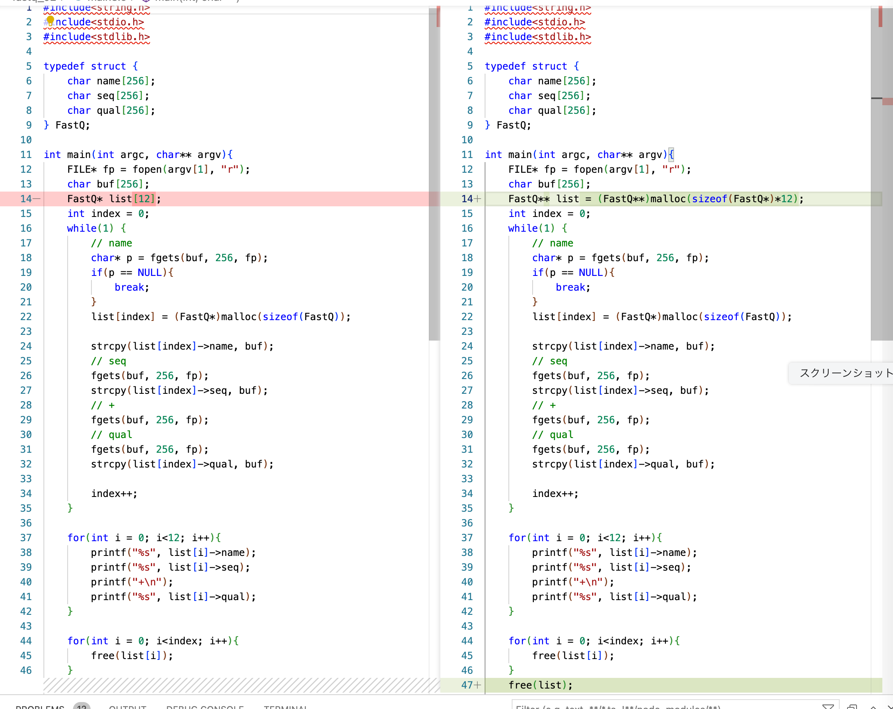

malloc()を使用して書き直したコードは以下のようになります。

```C
#include<string.h>
#include<stdio.h>
#include<stdlib.h>

typedef struct {
    char name[256];
    char seq[256];
    char qual[256];
} FastQ;

int main(int argc, char** argv){
    FILE* fp = fopen(argv[1], "r");
    char buf[256];
    FastQ* list[12];  // (1)
    int index = 0;
    while(1) {
        // name
        char* p = fgets(buf, 256, fp);
        if(p == NULL){
            break;
        }
        list[index] = (FastQ*)malloc(sizeof(FastQ)); // (2)

        strcpy(list[index]->name, buf); // (3)
        // seq
        fgets(buf, 256, fp);
        strcpy(list[index]->seq, buf);
        // +
        fgets(buf, 256, fp);
        // qual
        fgets(buf, 256, fp);
        strcpy(list[index]->qual, buf);

        index++;
    }

    for(int i = 0; i<index; i++){  // (4)
        free(list[i]);
    }

    return 0;
}
```
VisualStudio codeを利用して変更点だけを見ると次のような箇所だけです。


1. FastQ list[12] はポインタの配列 FastQ* list[12]に
1. list[index] = (FastQ\*)malloc(sizeof(FastQ))で1個ずつメモリを確保
1. list[index].nameは、list[index]->nameに
1. free(list[i])で構造体用のメモリを解放

ではこれなら400万本のリードでも大丈夫でしょうか？

実はまだ問題があります。FastQ\* list[4000000]を宣言すると、ポインタは1要素あたり8バイトのメモリを使用するのでポインタの配列だけでも合計32MBがスタック上に必要になってしまいます。この問題も解決するには、ポインタの配列もヒープから取得するしかありません。

```C
#include<string.h>
#include<stdio.h>
#include<stdlib.h>

typedef struct {
    char name[256];
    char seq[256];
    char qual[256];
} FastQ;

int main(int argc, char** argv){
    FILE* fp = fopen(argv[1], "r");
    char buf[256];
    FastQ** list = (FastQ**)malloc(sizeof(FastQ*)*12); // (1)
    int index = 0;
    while(1){
        // name
        char* p = fgets(buf, 256, fp);
        if(p == NULL){
            break;
        }
        list[index] = (FastQ*)malloc(sizeof(FastQ));

        strcpy(list[index]->name, buf);
        // seq
        fgets(buf, 256, fp);
        strcpy(list[index]->seq, buf);
        // +
        fgets(buf, 256, fp);
        // qual
        fgets(buf, 256, fp);
        strcpy(list[index]->qual, buf);

        index++;
    }

    for(int i = 0; i<index; i++){
        free(list[i]);
    }
    free(list);

    return 0;
}
```
これもVisualStudio codeを利用して変更点だけを見ると次のような箇所だけです。


FastQ\* list[12]はポインタの配列でしたが、今回はポインタの配列のメモリを確保するので、FastQ\*型へのポインタ、つまりFastQ\*\*をmalloc()で取得することになります。

```C
FastQz\*\* list = (FastQ\*\*)malloc(sizeof(FastQ\*)*12);
```
この例ではlistに96バイトのメモリがヒープから割り当てられ、スタックにはFastQ*配列の先頭へのポインタが格納されるので、スタックの消費は8バイトだけになります。あとは、12個を400万個に増やしたとしてもスタックの消費量は8バイトのままです。

さて、これで400万本のリードを処理できそうになりました。malloc(sizeof(FastQ\*)\*4000000)にするだけです。でも、ちょっと考えてみてください。いつも400万個分のスペースを確保するのは無駄すぎるようにも見えます。プログラムのあちこちで400万個分のスペースを確保していたら、ヒープメモリがいくらたくさん使えるといっても、小さいデータを処理する場合には無駄にメモリを使ってしまいます。

もっと小さなメモリから始めて、必要になったらメモリの割り当てを増やしていくようなやり方の方が、小さいデータなら小さいメモリ消費で、大きなデータならメモリを大量に使えるはずです。

このような問題を解決するため、次回は長さを自由に変えられる配列、つまり可変長配列についてご紹介します。