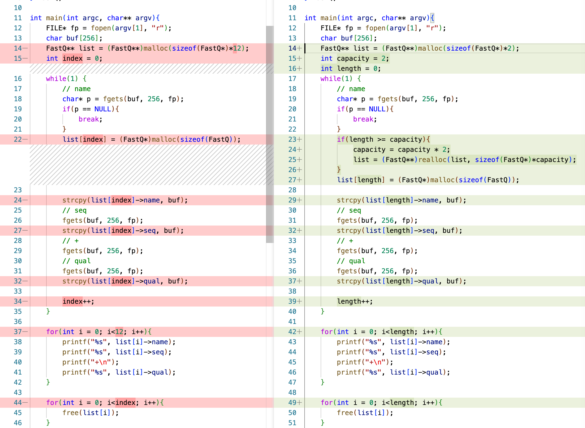
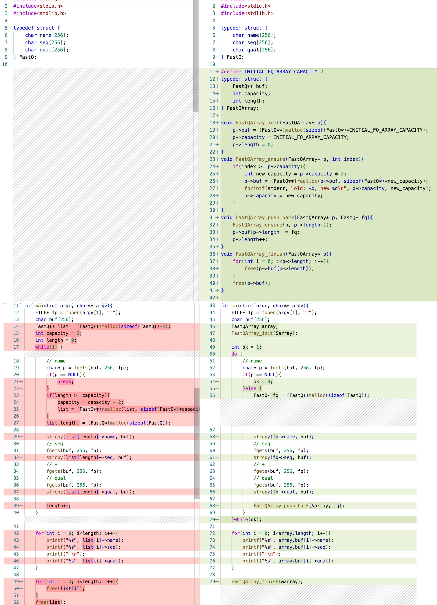

# 伸びる配列 - 可変長配列

計算機というものはとにかく柔らかいことや自由なことが苦手で、あらかじめはっきりと定義された文字列長やメモリ容量を確保することは問題ないのですが、
どんな長さの文字列を読み込むか事前には分からない場合や、
何個のデータを保持するかが事前には分からない場合は、開発者が汗を流してそのような仕組みを作らなければなりません。
Pythonなどでは柔軟に文字列の長さに簡単に対応できますが、落とし穴がないわけではありません。

## 文字の配列(文字列)の場合
例えば、これまではfgets()で1行単位での読み込みを行なってきましたが、バッファサイズは固定長にしていました。
1行が何文字か決まっていないファイル形式のデータを
読み込む場合には次のコードのように継ぎ足し継ぎ足し読み込んでいくことになります。
```C
#include <stdio.h>
#include <stdlib.h>
#include <string.h>

char* read_line(FILE* fp){
    int bufsize = 16;
    int capacity = bufsize;
    char* buf = (char*)malloc(bufsize);
    char* cur = buf;
    do {
        char* ret = fgets(cur, bufsize, fp);
        if(ret == NULL){
            break;
        }
        if(memchr(cur, '\0', bufsize) == NULL){ // if incomplete
            char* newbuf = (char*)malloc(capacity+bufsize);
            strncpy(newbuf, buf, capacity);
            free(buf);
            buf = newbuf;
            cur = newbuf + capacity - 1; // 次の読み込み開始点のアドレス
            capacity = capacity + bufsize;
        }else {
            return buf;
        }
    }while(1);

    return NULL;
}
int main(int argc, char** argv){
    FILE* fp = fopen(argv[1], "r");
    char* line;
    while(NULL != (line = read_line(fp))){
        printf("%s", line);
        free(line);
    }
    return 0;
}
```
PerlやPythonでは１行ずつ読み込む処理は簡単に書くことができますが、実際には裏ではこのような処理が走っているので、
１行が長い場合には度々メモリのアロケーションや文字列のコピーが発生して効率が悪くなるだろうということは
想像できると思います。C/C++やJavaなどの言語ではバッファサイズは自分で自由に決められるので、あらかじめ
無駄なアロケーションが頻発しない程度のバッファサイズにしておけば、数TBなどの巨大なデータでも
効率的に処理できます。

ちなみに以下のブロックはメモリを確保しなおして中の文字列をコピーする操作で、
これはreallocという関数でもっと簡単に書き換えることができます。
```C
    char* newbuf = (char*)malloc(capacity+bufsize);
    strncpy(newbuf, buf, capacity);
    free(buf);
    buf = newbuf;
```
```C
    buf = (char*)realloc(capacity+bufsize);
```
上記の二つは同じような動作をするものの実際にはreallocの方はメモリの後ろの領域に余裕があれば、そのまま使用中の
メモリを拡張して割り当ててくれるので、その場合はメモリのコピーが発生しないので、より効率が良いとされています。

## ポインタの配列の場合

これまでは12本までのリードしか読み込めないプログラムでしたが、以下のようにrealloc()でメモリを確保しなおせば
もっとたくさんのリードを読み込むことができます。下記の例では最初はバッファサイズは2ですが、足りなくなると
自動的に２倍に拡張する仕組みにしています。
```C
#include<string.h>
#include<stdio.h>
#include<stdlib.h>

typedef struct {
    char name[256];
    char seq[256];
    char qual[256];
} FastQ;

int main(int argc, char** argv){
    FILE* fp = fopen(argv[1], "r");
    char buf[256];
    FastQ** list = (FastQ**)malloc(sizeof(FastQ*)*2);
    int capacity = 2;
    int length = 0;
    while(1) {
        // name
        char* p = fgets(buf, 256, fp);
        if(p == NULL){
            break;
        }
        if(length >= capacity){
            capacity = capacity * 2;
            list = (FastQ**)realloc(list, sizeof(FastQ*)*capacity);
        }

        list[length] = (FastQ*)malloc(sizeof(FastQ));

        strcpy(list[length]->name, buf);
        // seq
        fgets(buf, 256, fp);
        strcpy(list[length]->seq, buf);
        // +
        fgets(buf, 256, fp);
        // qual
        fgets(buf, 256, fp);
        strcpy(list[length]->qual, buf);

        length++;
    }

    for(int i = 0; i<length; i++){
        printf("%s", list[i]->name);
        printf("%s", list[i]->seq);
        printf("+\n");
        printf("%s", list[i]->qual);
    }

    for(int i = 0; i<length; i++){
        free(list[i]);
    }
    free(list);

    return 0;
}
```
今回も前回とのコードの変更点をVisualStudio codeで差分として確認してみましょう。



いかがでしょうか？便利にはなってきたと思います。ただ、whileループの中にif文の分岐でメモリのアロケーションが入ってきたので、
少しコードがごちゃごちゃしてきました。リファクタリングして、綺麗にならないでしょうか。

まず以下の３つは互いに関係の深いものなので、これらはまとめてしまいたいと思います。
```C
    FastQ** list = (FastQ**)malloc(sizeof(FastQ*)*2);
    int capacity = 2;
    int length = 0;
```
また、メモリのアロケーションのような操作はビジネスロジック(やりたいことの本質)とは関係ない雑用のようなものなので、
これも見えないところに追い出したいと思います。

```C
#include<string.h>
#include<stdio.h>
#include<stdlib.h>

typedef struct {
    char name[256];
    char seq[256];
    char qual[256];
} FastQ;

#define INITIAL_FQ_ARRAY_CAPACITY 2
typedef struct {
    FastQ** buf;
    int capacity;
    int length;
} FastQArray;

void FastQArray_init(FastQArray* p){
    p->buf = (FastQ**)malloc(sizeof(FastQ*)*INITIAL_FQ_ARRAY_CAPACITY);
    p->capacity = INITIAL_FQ_ARRAY_CAPACITY;
    p->length = 0;
}
void FastQArray_ensure(FastQArray* p, int index){
    if(index >= p->capacity){
        int new_capacity = p->capacity * 2;
        p->buf = (FastQ**)realloc(p->buf, sizeof(FastQ*)*new_capacity);
        fprintf(stderr, "old: %d, new %d\n", p->capacity, new_capacity);
        p->capacity = new_capacity;
    }
}
void FastQArray_push_back(FastQArray* p, FastQ* fq){
    FastQArray_ensure(p, p->length+1);
    p->buf[p->length] = fq;
    p->length++;
}
void FastQArray_finish(FastQArray* p){
    for(int i = 0; i<p->length; i++){
        free(p->buf[p->length]);
    }
    free(p->buf);
}

int main(int argc, char** argv){
    FILE* fp = fopen(argv[1], "r");
    char buf[256];
    FastQArray array;
    FastQArray_init(&array);

    int ok = 1;
    do {
        // name
        char* p = fgets(buf, 256, fp);
        if(p == NULL){
            ok = 0;
        }else {
            FastQ* fq = (FastQ*)malloc(sizeof(FastQ));

            strcpy(fq->name, buf);
            // seq
            fgets(buf, 256, fp);
            strcpy(fq->seq, buf);
            // +
            fgets(buf, 256, fp);
            // qual
            fgets(buf, 256, fp);
            strcpy(fq->qual, buf);

            FastQArray_push_back(&array, fq);
        }
    }while(ok);

    for(int i = 0; i<array.length; i++){
        printf("%s", array.buf[i]->name);
        printf("%s", array.buf[i]->seq);
        printf("+\n");
        printf("%s", array.buf[i]->qual);
    }

    FastQArray_finish(&array);

    return 0;
}
```
これも差分を見てみましょう。


今回のリファクタリングの作業のポイントは以下のようなものです。
1. FastQArray構造体を作って、そこに配列のポインタを隠し、長さや容量もまとめておきます
2. FastQArrayの初期化関数 FastQArray_init()の内容をmain()関数から分離します
3. FastQArrayへの要素の追加はFastQArray_push_back()を通じて行うようにします
4. 容量のチェックと拡張はFastQArray_ensure()に分離します
5. メモリの解放はFastQArray_finish()に分離します

変更箇所はやや多くなってしまいましたが、基本的にはコードをコピペして移動して
関数に分けただけとも言えます。それだけのことですが、main()関数のwhileループ内は
すっきりして、メモリ管理のロジックは完全に追い出されました。

FastQArray_push_backは、配列の末尾に要素を追加する関数で、全てはこの中で
自動的にやってくれるので、main()関数だけ見るとPythonのコードのように
読みやすくなったのではないでしょうか。

ところで、このプログラムの中では二つの構造体、FastQとFastQArrayがありますが、
FastQの方はデータをまとめて保持する目的だけに使用していますが、
FastQArrayの方は手足となる関数を持っており、capacityとlengthという
外からは隔離された内部状態を表現する変数を持っています。このような
1. 内部状態を保つ
2. 外界とのやりとりを関数を通じて行う

ようなプログラムの部品のまとまりを**モジュール**と一般には呼びます。
つまり今回行った作業は「可変長配列をモジュールとして切り出した」ということになります。

今回は一つのソースコードのファイルに全部まとめて書いてしまいましたが、この
FastQArrayのようなモジュールは別のファイルとして分離して、分割コンパイルを行い
独立してテストしたり再利用したりといった使い方をしていくことになります。

モジュールとして分けて構築することの目的は、コードを読みやすくすることと、
再利用を促進することです。また、この読みやすさに付随して、モジュールに対して
変更を加えた場合でも影響をモジュール内に局所化して、モジュールの外部に修正の連鎖のような
形で影響しないように閉じ込める効果もあります。また、外部から内部状態の変数の変更禁止にすることで
外部からの影響も遮断できます。これが、いわゆるオブジェクト指向の「カプセル化」です。

例えば、末尾から要素を一つ取り除くpop()関数は次のようなものになるでしょう
```C
FastQ* pop(FastQArray* p){
    p->length--;
    return p->buf[length];
}
```
必要ならこれにキャパシティーを削減するする操作を加えることもできますし、空になった場合の
境界値チェックを入れてバグを予防するのも良いでしょう。そしてそのような改良を加えたとしても
この関数を呼ぶ側は特に変更する必要はないのです。

境界値チェックしてエラーにする例
```C
FastQ* pop(FastQArray* p){
    p->length--;
    if(p->length < 0){
        fprintf(stderr, "pop() is called on empty FastQArray!");
        exit(-1);
    }
    return p->buf[length];
}
```

境界値チェックしてNULLを返す例
```C
FastQ* pop(FastQArray* p){
    p->length--;
    if(p->length < 0){
        p->length = 0;
        return NULL;
    }
    return p->buf[length];
}
```

> **Note**
> FastQArrayの名称はやや長くて使いにくいので、これも後でなんとかしましょう。このような可変長配列としては、
> C++ではSTLのstd::vector、Javaではjava.util.Vectorやjava.util.Arrayなどが利用できます。
> この場合のベクターは「運ぶ」という方の意味で、プラスミドベクターやウイルスベクターと非常に似たニュアンスの用法です。

## 性能
今回の例では文字列は少しずつ配列を伸ばしていく仕組みで、FastQArrayの方は2倍ずつ増えていく仕組みとしました。
可変長配列に格納する要素数の変動が小さい場合は少しずつ伸ばすだけで十分です。一方、要素数が
指数関数的な分布をしているようなデータを格納する場合は2倍ずつ増やすなどの方がアロケーションの回数は
少なくて済むでしょう。

ただ指数分布的な要素数の場合、2倍ずつ増える場合は8GBのメモリのマシンで既に4GB以上使ってしまっていたら、そこから更に
2倍することはできないので、半分弱のメモリが使えずに死んだ領域になってしまう場合もあります。
2TBのメモリのマシンでも1TBしか使えないのではもったいない話です。そのあたりもC/C++等では自分で用途や実機の
メモリの搭載状況に合わせて適切にメモリの確保ルールを設計してやれば、全てのメモリを使い切ることも可能でしょう。

参考URL

1. https://towardsdatascience.com/how-lists-in-python-are-optimised-internally-for-better-performance-847c8123b7fa
  - Pythonでは32ずつ増えていく
