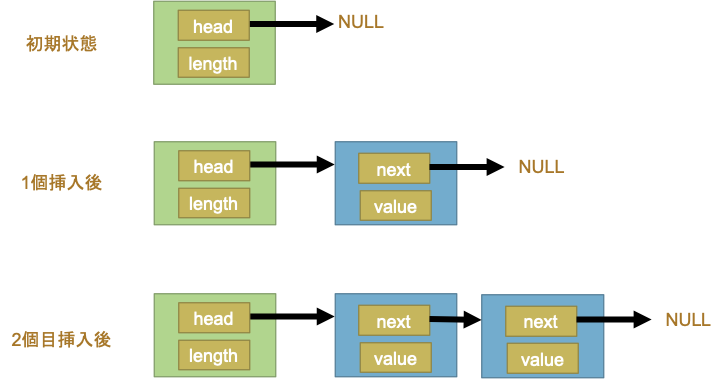
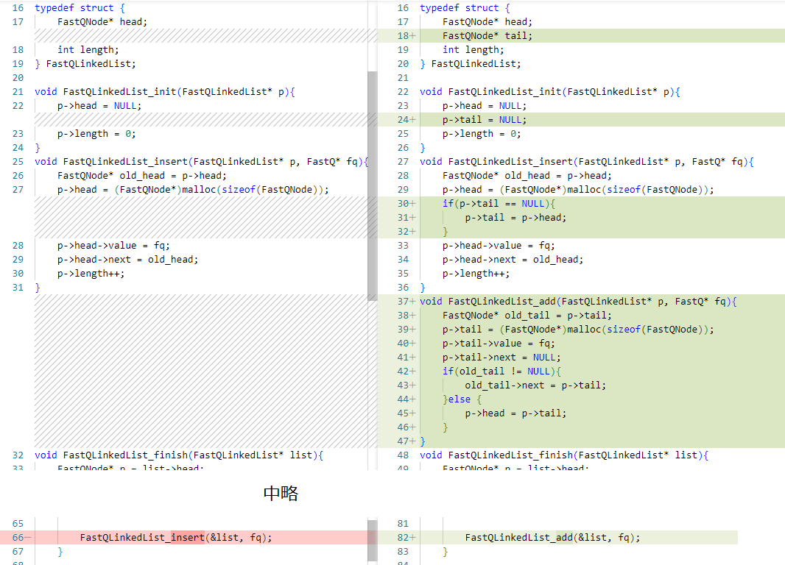

前回見たFastQArrayはArrayと呼ばれる可変長配列で、その実体はポインタの配列に皮を一枚かぶせたものでした。そしてそのような一次元の配列の
弱点として、時々メモリの再アロケーションと中身のコピーが必要となっており、規模の大きな配列になるほどそのコストも増大するという問題がありました。
特に配列の先頭に1要素を挿入しようとすると配列全体をシフトする必要があるので、巨大な配列の先頭への挿入は非常に非効率的なものになってしまいます。

今回紹介するLinkedListはそのようなコストのかからないデータ構造の一つです。以下の図は、空っぽの初期状態から、一個ずつ要素を
追加する様子を示したものです。



これによく似た現実のものとしては貨物列車があります。先頭の緑色の構造体は下記のコードではFastQLinkedListがこれにあたります。
これは貨物列車の機関車です。そして、青いノードを追加するのは貨物車両を後ろに連結します。積載物に相当するものが図の中のvalueです。
nextには次のノードへのポインタが格納されていて、これを先頭から順に辿ることで末尾のノードまでアクセスできる仕組みです。
```C
#include<string.h>
#include<stdio.h>
#include<stdlib.h>

typedef struct {
    char name[256];
    char seq[256];
    char qual[256];
} FastQ;

typedef struct FastQNode {
    FastQ* value;
    struct FastQNode* next;
} FastQNode;

typedef struct {
    FastQNode* head;
    int length;
} FastQLinkedList;

void FastQLinkedList_init(FastQLinkedList* p){
    p->head = NULL;
    p->length = 0;
}
void FastQLinkedList_insert(FastQLinkedList* p, FastQ* fq){
    FastQNode* old_head = p->head;
    p->head = (FastQNode*)malloc(sizeof(FastQNode));
    p->head->value = fq;
    p->head->next = old_head;
    p->length++;
}
void FastQLinkedList_finish(FastQLinkedList* list){
    FastQNode* p = list->head;
    while(p != NULL){
        free(p->value);
        FastQNode* tmp = p;
        p = p->next;
        free(tmp);
    }
}

int main(int argc, char** argv){
    FILE* fp = fopen(argv[1], "r");
    char buf[256];
    FastQLinkedList list;
    FastQLinkedList_init(&list);

    while(1) {
        // name
        char* p = fgets(buf, 256, fp);
        if(p == NULL){
            break;
        }
        FastQ* fq = (FastQ*)malloc(sizeof(FastQ));

        strcpy(fq->name, buf);
        // seq
        fgets(buf, 256, fp);
        strcpy(fq->seq, buf);
        // +
        fgets(buf, 256, fp);
        // qual
        fgets(buf, 256, fp);
        strcpy(fq->qual, buf);

        FastQLinkedList_insert(&list, fq);
    }

    FastQNode* p = list.head;
    while(p != NULL){
        printf(": %s", p->value->name);
        printf("%s", p->value->seq);
        printf("+\n");
        printf("%s", p->value->qual);
        p = p->next;
    }
    FastQLinkedList_finish(&list);

    return 0;
}
```
ところで、このプログラムは挿入の操作しか実装されていないので、実行すると
データが逆順に出力されます。このままでも問題なく使うことはできますが
push_back()あるいはadd(), append()のような操作をできるように関数を
追加してみましょう。

```C
#include<string.h>
#include<stdio.h>
#include<stdlib.h>

typedef struct {
    char name[256];
    char seq[256];
    char qual[256];
} FastQ;

typedef struct FastQNode {
    FastQ* value;
    struct FastQNode* next;
} FastQNode;

typedef struct {
    FastQNode* head;
    FastQNode* tail;
    int length;
} FastQLinkedList;

void FastQLinkedList_init(FastQLinkedList* p){
    p->head = NULL;
    p->tail = NULL;
    p->length = 0;
}
void FastQLinkedList_insert(FastQLinkedList* p, FastQ* fq){
    FastQNode* old_head = p->head;
    p->head = (FastQNode*)malloc(sizeof(FastQNode));
    if(p->tail == NULL){
        p->tail = p->head;
    }
    p->head->value = fq;
    p->head->next = old_head;
    p->length++;
}
void FastQLinkedList_add(FastQLinkedList* p, FastQ* fq){
    FastQNode* old_tail = p->tail;
    p->tail = (FastQNode*)malloc(sizeof(FastQNode));
    p->tail->value = fq;
    p->tail->next = NULL;
    if(old_tail != NULL){
        old_tail->next = p->tail;
    }else {
        p->head = p->tail;
    }
}
void FastQLinkedList_finish(FastQLinkedList* list){
    FastQNode* p = list->head;
    while(p != NULL){
        free(p->value);
        FastQNode* tmp = p;
        p = p->next;
        free(tmp);
    }
}

int main(int argc, char** argv){
    FILE* fp = fopen(argv[1], "r");
    char buf[256];
    FastQLinkedList list;
    FastQLinkedList_init(&list);

    while(1) {
        // name
        char* p = fgets(buf, 256, fp);
        if(p == NULL){
            break;
        }
        FastQ* fq = (FastQ*)malloc(sizeof(FastQ));

        strcpy(fq->name, buf);
        // seq
        fgets(buf, 256, fp);
        strcpy(fq->seq, buf);
        // +
        fgets(buf, 256, fp);
        // qual
        fgets(buf, 256, fp);
        strcpy(fq->qual, buf);

        FastQLinkedList_add(&list, fq);
    }

    FastQNode* p = list.head;
    while(p != NULL){
        printf(": %s", p->value->name);
        printf("%s", p->value->->seq);
        printf("+\n");
        printf("%s", p->value->->qual);
        p = p->next;
    }
    FastQLinkedList_finish(&list);

    return 0;
}
```

変更点は以下のような箇所です。



# 用途

## 一般的な用途
Linked Listは配列と比べて以下のような特徴があります。
- Pros
    - 先頭や末尾への挿入、削除のコストが小さい
    - 容量が増えても急激な大きなメモリのアロケーションなどが起きにくい
- Cons
    - Node用にメモリが追加で必要で、1個あたり+8バイトから+16バイト
    - 順方向、逆方向に辿ることは容易だが、ランダムアクセスは苦手

データを一次元状に配列したものをListと呼ぶことが多く、その中でも以下のような特徴を
備えたものはStackやQueueなどと呼ばれるものもあります。

- Stack
  - 末尾にへの追加 push()と取り出し pop()だけできる
- Queue
  - First In First Outで、先頭に挿入して末尾から取り出す、あるいはその逆
  - Double Ended Queue(DEQueue)
    - 両端からデータを出し入れできる
- Vector, Array
  - ほぼ同じ意味で使われる。中に配列を持つものが多い 
- Set
  - 順序を持たないデータの集合

## ゲノム解析、HPC向きな用途

データを入れておくだけであればArrayでもLinkedListでもどちらでも良い場合がありますが、
以下のような場合はLinkedListやQueueのようなものが好んで利用されます。

- LinkedBlockingQueue(Java)
Queueは日本語では待ち行列で、実際に処理待ちのデータを入れておくような用途に向いています。
例えばマルチスレッドのプログラムで、スレッドプールに計算タスクを投入する際、Javaでは
LinkedBlockingQueueを利用すると計算が入ってくるまでブロックして待たせることができます。

  -https://docs.oracle.com/javase/jp/8/docs/api/index.html?java/util/concurrent/BlockingQueue.html

- TreeSet (java)
  - 構造は一次元ではなく、ツリー構造ですがトラバースすることで1次元の配列のように使うことができます。
  - SortedSet、つまり常にソートされた状態が保たれているコレクションで、1次元よりも検索が高速にできます。
  - データを優先順位の順序で維持された状態を場合などに便利です。

- LinkedList
  - ゲノム解析ではデータが長大なので100baseなどの範囲に区切って解析したりといった工夫が必要ですが、
   区切りを設けずにシームレスに解析したい場合には、LinkedListのようなデータ構造を使うと
   簡単に実現できます。100base分のリストの末尾に一塩基読み込んだら先頭の1塩基分のデータを捨てるだけです。
   それを染色体の短腕から長腕の端まで繰り返します。

- 環状リスト
  - プラスミドやバクテリアゲノムなどは環状ですが、その塩基配列から特定の塩基配列を検索したい場合などに環状リストで実装するとoriをまたいでシームレスに計算することができます。

- HashSet, HashTable, HashMap (Java, C++、Python(dict)、Perl(ハッシュ)等)
  - 重複のないデータセットを作りたい場合や、データ同士の対応付けに便利なコレクションです。
  - HashSetは一次元で、HashTableとHashMapはKeyとValueのペアのコレクションです。
  - Nullを許すか許さないかという違いが実装によってあったりします。
  - 重複するキーの挿入を許すものと許さないものがあります。重複を許さない実装しかない場合は、HashTableの値にLinkedListを持たせてやると重複するデータも保持させられます。
  
> **Note**
> コレクションというのは、データを集めて入れておく入れ物のことで、Listのように1次元のものや、
> Treeのように木構造のもの、Tableのように表形式のもの、SetやBagのように順序を持たないものなどがあります。
> C++等では「コンテナ」と呼ばれることもあります。C++ではStandard template library(STL)の一部として
> 提供されており、Javaではjava.utilパッケージ以下のコレクションライブラリとして提供されています。

> **Note**
> ハッシュテーブルについては別の回でご紹介します。
