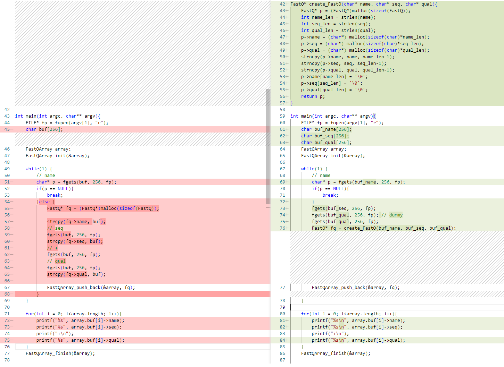
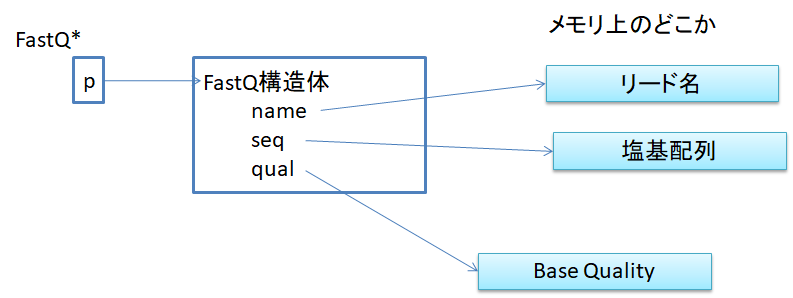

# よりスマートな構造
これまで見てきたFastQファイルはリード長は最大255塩基としてきました。
一方、実際のshort readのシーケンスは150塩基以下のデータが多いので、
約40%ほどメモリを無駄に消費していることになります。またリード名は
それよりも短いことも多いので、50%程度は無駄かも知れません。

この無駄を無くすには以下のようなFastQ構造体を
```C
typedef struct {
    char name[256];
    char seq[256];
    char qual[256];
} FastQ;
```
次のように修正して、任意の長さの文字列へのポインタとして、
個別にメモリをアロケーションしてやるのが最も効率的です。
```C
typedef struct {
    char* name;
    char* seq;
    char* qual;
} FastQ;
```

main5.c次のように修正してmain6.cを作成します。上のようなFastQ構造体の修正も
合わせて行って下さい。



変更箇所の要点は以下の通りです。
- 構造体のメンバーを文字配列から文字列のポインタに変更
- FastQの生成がやや複雑になるのでcreate_FastQ関数に処理を移動
- create_FastQ関数では以下の処理を行います
  - 文字列の長さを調べ
  - 必要量のメモリを割り当て
  - 一時バッファから割り当てたメモリにデータをコピー、ただし改行文字は除く
  - 行末の改行文字のあった位置にヌル文字を入れる
- 出力時に改行文字の出力を追加

main6.c
```C
#include<string.h>
#include<stdio.h>
#include<stdlib.h>

typedef struct {
    char* name;
    char* seq;
    char* qual;
} FastQ;

#define INITIAL_FQ_ARRAY_CAPACITY 2
typedef struct {
    FastQ** buf;
    int capacity;
    int length;
} FastQArray;

void FastQArray_init(FastQArray* p){
    p->buf = (FastQ**)malloc(sizeof(FastQ*)*INITIAL_FQ_ARRAY_CAPACITY);
    p->capacity = INITIAL_FQ_ARRAY_CAPACITY;
    p->length = 0;
}
void FastQArray_ensure(FastQArray* p, int index){
    if(index >= p->capacity){
        int new_capacity = p->capacity * 2;
        p->buf = (FastQ**)realloc(p->buf, sizeof(FastQ*)*new_capacity);
        fprintf(stderr, "old: %d, new %d\n", p->capacity, new_capacity);
        p->capacity = new_capacity;
    }
}
void FastQArray_push_back(FastQArray* p, FastQ* fq){
    FastQArray_ensure(p, p->length+1);
    p->buf[p->length] = fq;
    p->length++;
}
void FastQArray_finish(FastQArray* p){
    for(int i = 0; i<p->length; i++){
        free(p->buf[p->length]);
    }
    free(p->buf);
}
FastQ* create_FastQ(char* name, char* seq, char* qual){
    FastQ* p = (FastQ*)malloc(sizeof(FastQ));
    int name_len = strlen(name);
    int seq_len = strlen(seq);
    int qual_len = strlen(qual);
    p->name = (char*) malloc(sizeof(char)*name_len);
    p->seq = (char*) malloc(sizeof(char)*seq_len);
    p->qual = (char*) malloc(sizeof(char)*qual_len);
    strncpy(p->name, name, name_len-1);
    strncpy(p->seq, seq, seq_len-1);
    strncpy(p->qual, qual, qual_len-1);
    p->name[name_len] = '\0';
    p->seq[seq_len] = '\0';
    p->qual[qual_len] = '\0';

    return p;
}

int main(int argc, char** argv){
    FILE* fp = fopen(argv[1], "r");
    char buf_name[256];
    char buf_seq[256];
    char buf_qual[256];
    FastQArray array;
    FastQArray_init(&array);

    while(1) {
        // name
        char* p = fgets(buf_name, 256, fp);
        if(p == NULL){
            break;
        }
        fgets(buf_seq, 256, fp);
        fgets(buf_qual, 256, fp); // dummy
        fgets(buf_qual, 256, fp);
        FastQ* fq = create_FastQ(buf_name, buf_seq, buf_qual);
        FastQArray_push_back(&array, fq);
    }

    for(int i = 0; i<array.length; i++){
        printf("%s\n", array.buf[i]->name);
        printf("%s\n", array.buf[i]->seq);
        printf("+\n");
        printf("%s\n", array.buf[i]->qual);
    }
    FastQArray_finish(&array);

    return 0;
}
```

これで一時バッファを除けば、文字の配列はほとんどなくなって、
データのほとんどがヒープ上のポインタとして保持するように
なりました。

理解できているかどうか心配な方は、
以下のような図を頭の中に思い描きながら書けていれば大丈夫です。


このようなメモリ上でのデータの持ち方は、PythonやJavaでは
最も基本的なものです。

上記のmain6.cと同等のコードをPythonとJavaで書くと以下のようになります。

Pyton版 main6.py
```python
import os

class FastQ:
    def __init__(this, name, seq, qual):
        this.name = name
        this.seq = seq
        this.qual = qual

list = []

with open("test.fastq", "r") as fp:
    while True:
        name = fp.readline().rstrip(os.linesep)
        if name == "":
            break
        seq = fp.readline().rstrip(os.linesep)
        dummy = fp.readline().rstrip(os.linesep)
        qual = fp.readline().rstrip(os.linesep)
        list.append(FastQ(name, seq, qual))

for x in list:
    print(x.name)
    print(x.seq)
    print("+")
    print(x.qual)
```

Java版 Main6.java
```Java
import java.util.ArrayList;
import java.io.BufferedReader;
import java.io.FileReader;
import java.io.IOException;

public class Main6 {
    static public class FastQ {
        String name;
        String seq;
        String qual;
        public FastQ(String n, String s, String q){
            name = n;
            seq = s;
            qual = q;
        }
    }
    public static void main(String[] argv){
        ArrayList<FastQ> list = new ArrayList<>();
        try  {
            BufferedReader br = new BufferedReader(new FileReader(argv[0]));
            while(true){
                String name = br.readLine();
                String seq = br.readLine();
                br.readLine();
                String qual = br.readLine();
                if(name == null){
                    break;
                }
                FastQ fq = new FastQ(name, seq, qual);
                list.add(fq);
            }
            for(FastQ fq: list){
                System.out.println(fq.name + "\n" + fq.seq + "\n+\n" + fq.qual + "\n");
            }
        }catch(Exception e){
            e.printStackTrace();
        }
    }
}
```

メイン関数だけをこの3つのプログラムで比較してみるとどうでしょうか？
非常によく似ているのではないでしょうか。また、C言語では自分で
可変長配列を用意してやる必要がありましたが、PythonやJavaでは標準ライブラリに
もともと備わっていて作る必要がないので、そのぶんだけ非常にシンプルなプログラムで
済んでいます。

逆にPythonやJavaを使うとシンプルに書けますが、それらをやむなく性能向上のために
C言語に移植する場合は基本的なプログラムの構造はそのままに、今回の可変長配列のように足りないものを
作り足してやればほぼそのまま移植できそうです。
PythonやJavaでメモリが足りなくなりそうだったり、計算速度に不満が出そうだったり、
あるいはGPU版としてC/C++に移植する可能性のあるコードはあらかじめ
プログラミング言語間でも移植しやすいコーディングを心がけておくと
良いでしょう。

ここまでの範囲に登場したポインタは全て文字列や構造体を指すものでした。
これはPythonとJavaの「参照」と呼ばれるものと全く同じ用法です。
このようなポインタ(参照)はヒープ上のどこかにあるデータ本体を
指していて、ポインタはいつもデータ本体の代用品として使われます。

大事なことなので二度書くと「ポインタ(参照)はデータ本体の代用品」です。

> **Not**
> Javaでもポインタと呼ばれることもあります。Java、Python、Perl等では用語としての「ポインタ」と「参照」はほぼ同じ意味と
> 考えて問題ありません。ただし、C++のようにポインタと参照を文法的に区別して使うものもあります。

なぜデータ本体をそこに置かないのか、というのはもっともな話です。
最初の方で見た例としては、スタックは8MBしかないからヒープを使う、
という説明でしたが、スタックのサイズは実はOSの設定で割り当てを
増やすこともできます。

では、それを大幅に増やすと何が起きるかというと、
扱うデータ量が多い場合にはスタックの積み降ろしの一回あたりの
メモリ量が数MBになり、もはやキャッシュメモリには収まらなくて
メインメモリへのアクセスが頻発することになるはずで、そうなると
計算の効率が大幅に低下するはずです。一般にキャッシュメモリの
アクセス速度はメインメモリの10倍とも言われているので、10倍程度の
速度の低下は覚悟が必要かもしれません。

メインメモリは大容量化と価格低下が速いので、一般的なパソコンでも
32GBや64GB搭載したものも増えてきました。一方、キャッシュメモリは
というとXeonなどのハイエンドのものでも10MB程度、PCでは4MBから8MBほどのものが多いようです。

一般的にCPUの型番と一緒に表記されるキャッシュはLevel 3キャッシュ(L3 cache)と
呼ばれるもので、CPUに近い順にLevel 1 キャッシュ、Level 2キャッシュ、Level 3キャッシュが
内臓されています。速いものほどCPUに近く、容量も小さいので、できるだけ
使わないデータはキャッシュの外に置いたままにしておいて、
必要なデータだけを速いキャッシュ入れて使う方が計算は効率的に進みます。

例えばFastQ構造体もリード1本分のデータを構造体に丸ごと入れておくと
構造体内のリード名へのアクセスがあった際には塩基配列やBaseQualityごと
キャッシュにロードされてしまいますが、今回のようにポインタとして分離して
おけば、リード名にアクセスしたときはリード名だけをキャッシュに上げてくれそうです。
つまり、リード名を使ってソートする場合には、構造体丸ごとよりも4倍以上の数の
リード名をキャッシュ内で使うことができるはずです。

そして、PythonやJavaではそのようなことを特に意識しなくても
普通にプログラムを書けばそのように振る舞うように、プログラミング言語が
デザインされているということでもあります。
PythonやJavaが使える環境や条件であれば、C/C++は第1の選択肢から外して良いと
私も思います。
ただ、背後ではこのような仕組みで動作しているということを知っていれば、
普段はC/C++でコードを書かなくとも、PyhonやJavaでも効率的な
プログラムを書くことが可能になるでしょう。

一方、C/C++を第1の選択肢として考えなければならない場合があるとすれば、
これまでに見てきたような「参照」だけでは済まないポインタの使い方が
必要となるケースで、そこではポインタの演算などの話が避けられなくなります。
より具体的には
- データのシリアライズ/デシリアライズが必要な場合
  - 通信やデバイス上へのデータの永続化のため
  - GPUデバイス等へのメモリブロックの転送
- メモリの大量の確保と破棄の繰り返し 
  - アロケーションのコストが高い場合や、GCが問題になる場合

これらは大雑把に言えば、メモリ上でのデータの保持の仕方を
コントロールしたい場合ということです。具体的に言えば、通信に備えて
連続したメモリ領域にデータを集めておきたい場合や、
メモリのアロケーションのように高いコストのシステムコールを
何十億回も発行して確保・解放するのは無駄なので、
予め確保しておいたメモリを繰り返し再利用したい場合
ということになります。

このような状況でなければ、C/C++を使う必要はないのですが、
ゲノム解析では避けられない場合もあるようなので
後日、紹介できればと思います。
