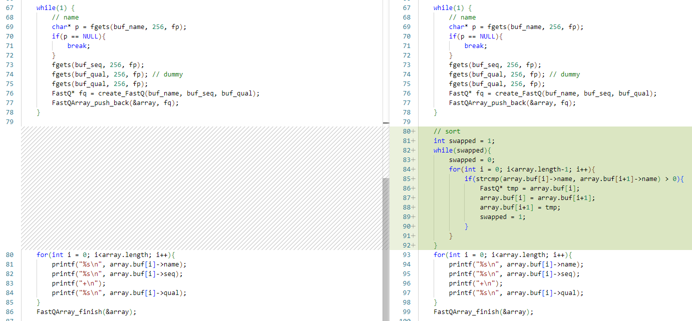
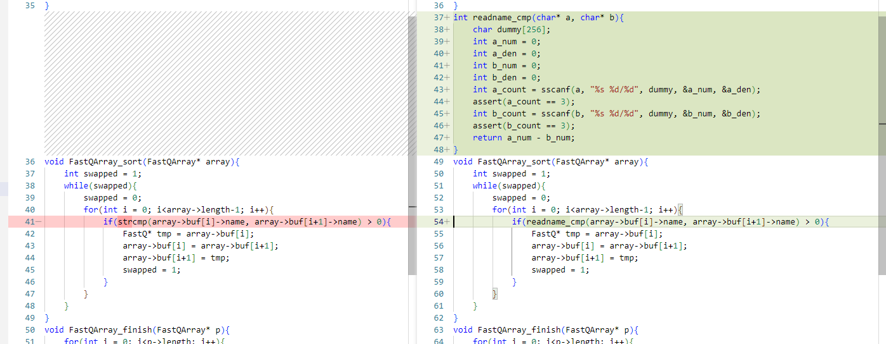
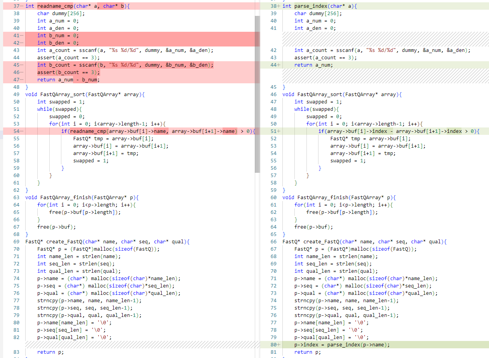

# 並び替え(ソート)

並び替えのアルゴリズムには様々のものがあります。標準ライブラリとし、Cではクイックソート、Javaでは修正マージソートが
デフォルトで提供されているので、それらに不満がなければ自分で作る機会もなく、必要もないと思います。

このチュートリアルの目的は、それがどのような仕組みで動いているか、染色体順ソート(Reference ordered data)のような
私たちの分野特有な順序のソートはどのようにすれば実現できるのかを紹介することです。まずは簡単な例から
見ていきましょう。

前回のmain6.cに以下のようなコードを書き足してやると、[main7.c](https://github.com/bitsyamagu/Effective-programming-mostly-C/blob/master/fastq_06/main7.c)
のような簡単なバブルソートができます。



> **Note**
> なぜバブルソートにしたかというと、最も単純だからです。

バブルソートは隣同士の要素を比較して、右側の要素が大きければそのまま、左側要素が大きければ
入れ替えるという操作を、入れ替えの必要がなくなるまでひたすら繰り返すというアルゴリズムです。
入れ替えの必要がなくなった時点で、データは全て昇順にソートされた状態になります。

人間はミカンを小さい順に並べるときに、あまり1個ずつの大きさを意識せずに
視覚的にざっと並べてしまうかもしれませんが、計算機での並び替えは、常に
1対1の比較の繰り返しが基本です。賢いソートアルゴリズムは、データを
グループ化したり、比較する順序を工夫したり、並列に処理できたりと様々な
工夫がほどこされていますが、それでも必ず1対1の比較を行うので、
比較方法さえプログラム内で決めてやれば、あとはどのアルゴリズムを使うにしても
複雑な並び替えルールだったとしても実現できるということです。

ところで、プログラムのmain関数内にソートのロジックがあると邪魔なので、
以下のコードではFastQArray_sort関数を作成して、そこにソートの処理を
移動しました。

関数の定義：
```C
void FastQArray_sort(FastQArray* array){
    int swapped = 1;
    while(swapped){
        swapped = 0;
        for(int i = 0; i<array->length-1; i++){
            if(strcmp(array->buf[i]->name, array->buf[i+1]->name) > 0){
                FastQ* tmp = array->buf[i];
                array->buf[i] = array->buf[i+1];
                array->buf[i+1] = tmp;
                swapped = 1;
            }
        }
    }
}
```
  
関数呼び出し：
```C
FastQArray_sort(&array);
```
ちなみに、ここで実際に並び替えているのはポインタです。データの実体はポインタの指す先の
メモリにあるので、実体の方は全く移動しないままポインタだけがソートされていきます。

ポインタは32ビットの計算機なら全て4バイト、64ビットの計算機なら全て8バイトといったように
計算機の中では大きさが固定されているので、入れ替えても大きさの違いなどによるはみ出しや、それに
伴うデータの移動などは起こりません。64ビットの計算機のメモリのアドレスは64bit(8byte)というのは
当たり前といえば当たり前ですが、ポインタという形にすれば様々な大きさのデータを配列として扱ったり
入れ替えたりできるということもポインタを使うことのメリットの一つです。

main8.c
```C
#include<string.h>
#include<stdio.h>
#include<stdlib.h>

typedef struct {
    char* name;
    char* seq;
    char* qual;
} FastQ;

#define INITIAL_FQ_ARRAY_CAPACITY 2
typedef struct {
    FastQ** buf;
    int capacity;
    int length;
} FastQArray;

void FastQArray_init(FastQArray* p){
    p->buf = (FastQ**)malloc(sizeof(FastQ*)*INITIAL_FQ_ARRAY_CAPACITY);
    p->capacity = INITIAL_FQ_ARRAY_CAPACITY;
    p->length = 0;
}
void FastQArray_ensure(FastQArray* p, int index){
    if(index >= p->capacity){
        int new_capacity = p->capacity * 2;
        p->buf = (FastQ**)realloc(p->buf, sizeof(FastQ*)*new_capacity);
        fprintf(stderr, "old: %d, new %d\n", p->capacity, new_capacity);
        p->capacity = new_capacity;
    }
}
void FastQArray_push_back(FastQArray* p, FastQ* fq){
    FastQArray_ensure(p, p->length+1);
    p->buf[p->length] = fq;
    p->length++;
}
void FastQArray_sort(FastQArray* array){
    int swapped = 1;
    while(swapped){
        swapped = 0;
        for(int i = 0; i<array->length-1; i++){
            if(strcmp(array->buf[i]->name, array->buf[i+1]->name) > 0){
                FastQ* tmp = array->buf[i];
                array->buf[i] = array->buf[i+1];
                array->buf[i+1] = tmp;
                swapped = 1;
            }
        }
    }
}
void FastQArray_finish(FastQArray* p){
    for(int i = 0; i<p->length; i++){
        free(p->buf[p->length]);
    }
    free(p->buf);
}
FastQ* create_FastQ(char* name, char* seq, char* qual){
    FastQ* p = (FastQ*)malloc(sizeof(FastQ));
    int name_len = strlen(name);
    int seq_len = strlen(seq);
    int qual_len = strlen(qual);
    p->name = (char*) malloc(sizeof(char)*name_len);
    p->seq = (char*) malloc(sizeof(char)*seq_len);
    p->qual = (char*) malloc(sizeof(char)*qual_len);
    strncpy(p->name, name, name_len-1);
    strncpy(p->seq, seq, seq_len-1);
    strncpy(p->qual, qual, qual_len-1);
    p->name[name_len] = '\0';
    p->seq[seq_len] = '\0';
    p->qual[qual_len] = '\0';
    return p;
}

int main(int argc, char** argv){
    FILE* fp = fopen(argv[1], "r");
    char buf_name[256];
    char buf_seq[256];
    char buf_qual[256];
    FastQArray array;
    FastQArray_init(&array);

    while(1) {
        // name
        char* p = fgets(buf_name, 256, fp);
        if(p == NULL){
            break;
        }
        fgets(buf_seq, 256, fp);
        fgets(buf_qual, 256, fp); // dummy
        fgets(buf_qual, 256, fp);
        FastQ* fq = create_FastQ(buf_name, buf_seq, buf_qual);
        FastQArray_push_back(&array, fq);
    }

    // sort
    FastQArray_sort(&array);
    for(int i = 0; i<array.length; i++){
        printf("%s\n", array.buf[i]->name);
        printf("%s\n", array.buf[i]->seq);
        printf("+\n");
        printf("%s\n", array.buf[i]->qual);
    }
    FastQArray_finish(&array);

    return 0;
}
```

全部を表示すると見にくいので、試しに以下のように出力の一部をコメントあうとしてソート結果を
確認してみましょう。
```C
    for(int i = 0; i<array.length; i++){
        printf("%s\n", array.buf[i]->name);
   //   printf("%s\n", array.buf[i]->seq);
   //   printf("+\n");
   //   printf("%s\n", array.buf[i]->qual);
    }
```
結果
```
old: 2, new 4
old: 4, new 8
old: 8, new 16
@SRR8206481.1 1/1
@SRR8206481.10 10/1
@SRR8206481.11 11/1
@SRR8206481.12 12/1
@SRR8206481.2 2/1
@SRR8206481.3 3/1
@SRR8206481.4 4/1
@SRR8206481.5 5/1
@SRR8206481.6 6/1
@SRR8206481.7 7/1
@SRR8206481.8 8/1
@SRR8206481.9 9/1
```
@SRR8206481.1 1/1の次に@SRR8206481.2 2/1が来てほしかったところが、@SRR8206481.10 10/1が来て
しまいました。これはリード名の比較に使用しているstrcmpが辞書順の比較をするためです。
これを番号順としてソートするには、以下のような関数を作成して番号で比較してやると良いでしょう。



* sscanf
  - sscanf関数は、文字列バッファから指定した変数を読み取る関数です。文字列から数字を取り出す関数には
他にatoiやstrtodなどがあります。今回使用したsscanfやscanf関数はフォーマット付き入力用関数といったような
名称で呼ばれるもので、入力フォーマットがあらかじめ決まっているような場合に便利な関数です。
読み込みに成功した変数の数を返すので、それを使ってassert関数でチェックしています。
* assert
  -  assert関数は渡された条件式を評価して偽になると、そこでプログラムを強制終了させるチェック用の
     関数です。絶対に偽になってはいけないような場合に用いることが多いと思います。
  - ユーザにエラーを通知する目的の関数ではないので、発生しやすいエラーに対してはassertではなく
    fprintfなどでエラーのログを出力してください
```C
     // 例
     if (fp == NULL){
         fprintf(stderr, "Cannot open file %s\n", filename);
         exit(-1);
     }
```
* strcmp
  - strcmpはstrcmp(a, b)のように呼ばれた時、以下のような値を返します。
    -  a < bなら負の数を返す
    -  a == b なら0を返す
    -  a > bなら正の数を返す
  - readname_cmp関数も比較したい数字を取り出して、上記と同じような返り値を返すようにしました。 


[main9.c](https://github.com/bitsyamagu/Effective-programming-mostly-C/blob/master/fastq_06/main9.c)

main9.cをコンパイルして実行すると、以下のような結果になりました。これなら期待通りです。
```
old: 2, new 4
old: 4, new 8
old: 8, new 16
@SRR8206481.1 1/1
@SRR8206481.2 2/1
@SRR8206481.3 3/1
@SRR8206481.4 4/1
@SRR8206481.5 5/1
@SRR8206481.6 6/1
@SRR8206481.7 7/1
@SRR8206481.8 8/1
@SRR8206481.9 9/1
@SRR8206481.10 10/1
@SRR8206481.11 11/1
@SRR8206481.12 12/1
```
でも、ちょっと待ってください。このままでは、比較のたびにscanfを含むreadname_cmp関数が呼ばれることになるので、
効率が悪そうです。もっと効率的に比較できるようにFastQ構造体に次のようにindexのフィールドを追加して
そこに番号を入れておいて比較に使いましょう。




[main10.c](https://github.com/bitsyamagu/Effective-programming-mostly-C/blob/master/fastq_06/main10.c)
