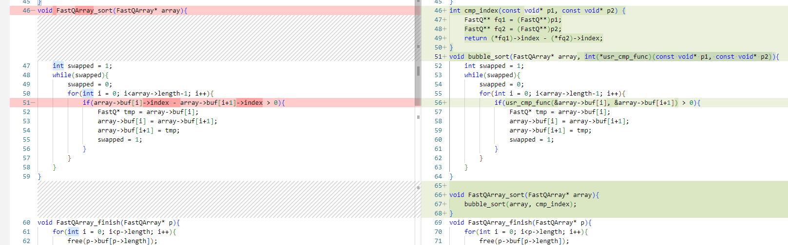

# イルミナのリード名によるソート

これまでに見てきたリード名「@SRR8206481.1 1/1」はSRAから入手したデータのリード名の
形式でした。

このようなリード名であれば1/1の分子の数字を抽出して、その順にソートしてやればよかったのですが、
イルミナのリード名は以下のような形式です。
```
@SIM:1:FCX:1:15:6329:1045:GATTACT+GTCTTAAC 1:N:0:ATCCGA
```
> https://support.illumina.com/help/BaseSpace_Sequence_Hub/Source/Informatics/BS/FileFormat_FASTQ-files_swBS.htm より

<table>
<th>値<th> 意味 </th> 
  <tr><td> sim<td> instrument ID</td>
<tr><td>   1<td> run number</td>
<tr><td> fcx<td> flow cell ID</td>
<tr><td>   1<td> lane number</td>
<tr><td>  15<td> tile number</td>
<tr><td>6329<td> x coordinate of cluster</td>
<tr><td>1045<td> y coordinate of cluster</td>
</table>

一般的なWhole exomeのデータの場合は1回のシーケンシングで、単一レーンで
済むようなデータが多いのでInstrument ID, Run number, Flow cell ID, Lane numberまでは
共通になるので、その後ろだけを見て並び替えれば良いことになります。実際に
Oprical dupilcationの除去は同一タイル内で、X,Y座標が近いリード同士で
チェックすることになるはずなので、タイル番号と座標で並び替えておけば十分です。

比較の優先順位としては <strong>tile number &gt; x coordinate &gt; y coordinate</strong>
ということになります。

前回実装したバブルソートを改良してこのようなソートを実装しても良いですが、
違うのは配列名の比較方法だけなので、できるだけ単純な仕組みで、
SRAのソートとイルミナのソートを切り替えられるようにしようと思います。

まず、ソートもバブルソートの名前を付けて別の関数bubble_sort()に分離し、比較関数も切り替えやすいように
cmp_index()という名前で独立させます。

          
また、リード名の比較はバブルソートのアルゴリズム内で行なっているわけですが
そこにイルミナ

```C
void bubble_sort(FastQArray* array){
  ...（略)...
  if(イルミナの場合){
     // illumina read名の比較
  }else if(SRAの場合){
     //  SRA read名の比較
  }
  ...（略)...
```
