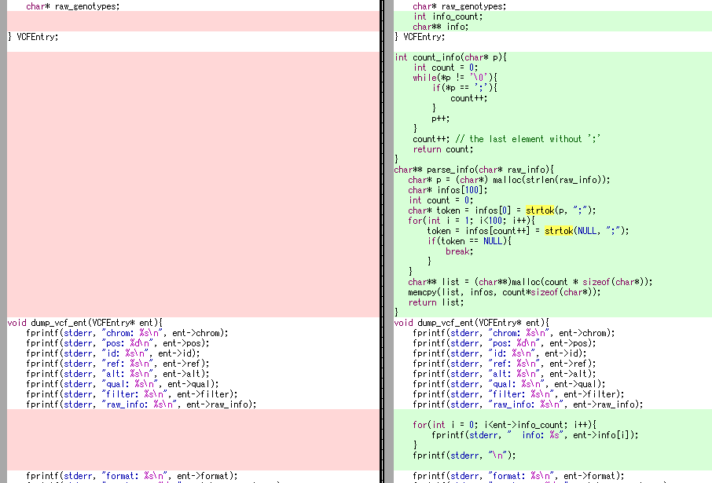

# 表形式データの利用

今回扱うのはVCF形式です。VCF形式はファイルとしてはタブ区切りテキスト形式なので、C言語で読み込む際にはstrtok()関数を利用することが多いと思います。strtokはstring tokenizerの略で文字列を入力としてトークンに分解する関数です。strtokについてよくご存知の方は、この記事は読み飛ばしていただいて構いません。

今回は、このstrtok()関数は少々使いにくいところがあるので、そのあたりを確認しながら見ていきましょう。

まず、おさらいとして、以下のコードはstrtok()の例です。```strtok(str, " ")```のように最初に分割したい文字列とデリミタ(区切り文字)を渡して初期化した後、strtok(NULL, " ")で次々とトークンを切り出していきます。そして文字列の終端に至るとNULLを返すという仕様です。

main1.c
```C
#include<string.h>
#include<stdio.h>

int main(int argc, char** argv){
    char str[256];
    sprintf(str, "Effective programming mostly in C");

    char* token = strtok(str, " ");
    printf("%s\n", token);
    while(NULL != (token = strtok(NULL, " "))){
        printf("%s\n", token);
    }
    return 0;
}
```
strtokを利用して、VCF形式のファイルをパージングするには、以下のようなコードになります。ただし、INFOフィールドはまだ分割していません。

vcf1.c
```C
#include<stdio.h>
#include<string.h>
#include<stdlib.h>

typedef struct {
    char* chrom;
    int pos;
    char* id;
    char* ref;
    char* alt;
    char* qual;
    char* filter;
    char* raw_info;
    char* format;
    char* raw_genotypes;
} VCFEntry;

void dump_vcf_ent(VCFEntry* ent){
    fprintf(stderr, "chrom: %s\n", ent->chrom);
    fprintf(stderr, "pos: %d\n", ent->pos);
    fprintf(stderr, "id: %s\n", ent->id);
    fprintf(stderr, "ref: %s\n", ent->ref);
    fprintf(stderr, "alt: %s\n", ent->alt);
    fprintf(stderr, "qual: %s\n", ent->qual);
    fprintf(stderr, "filter: %s\n", ent->filter);
    fprintf(stderr, "raw_info: %s\n", ent->raw_info);
    fprintf(stderr, "format: %s\n", ent->format);
    fprintf(stderr, "genotypes: %s\n", ent->raw_genotypes);
}
VCFEntry* parse_vcf_line(char* buf){
   char* p = (char*) malloc(strlen(buf));
   strcpy(p, buf);

   VCFEntry* ent = (VCFEntry*)calloc(1, sizeof(VCFEntry));
   char* token = strtok(p, "\t");
   ent->chrom = token;
   for(int i = 1; i<9; i++){
       token = strtok(NULL, "\t");
       // printf("token: %s\n", token);
       switch (i) {
           case 1:
             ent->pos = atoi(token);
             break;
           case 2:
             ent->id = token;
             break;
           case 3:
             ent->ref = token;
             break;
           case 4:
             ent->alt = token;
             break;
           case 5:
             ent->qual = token;
             break;
           case 6:
             ent->filter = token;
             break;
           case 7:
             ent->raw_info = token;
             break;
           case 8:
             ent->format = token;
             ent->raw_genotypes = ent->format + strlen(token) + 1;
             dump_vcf_ent(ent);
             break;
           default:
             fprintf(stderr, "unknown column %s\n", token);
             break;
       }
       if(ent->raw_genotypes){
           break;
       }
   }
   return ent;
}

int main(int argc, char** argv){
    char buf[512];
    FILE* fp = fopen(argv[1], "r");

    while(NULL != fgets(buf, 512, fp)){
        if(buf[0] == '#'){
            // skip comment
            continue;
        }
        VCFEntry* vent = parse_vcf_line(buf);
        // do something on vent
        free(vent);
    }
    fclose(fp);
}
```

上記のコードは問題なく動きます。ではこれを改良して、INFOフィールドも分割するようにしてみましょう。以下のように変更します。



変更後のプログラムは、<a href="strtok/vcf2.c">strtok/vcf2.c</a>です。

このコードはコンパイルは通りますが、実はうまく動作しません。筆者の環境ではコアダンプして異常終了しました。

なぜ、このようなことが起きるのかを理解するには、strtok()が内部で何をやっているかを知っていれば分かりやすいでしょう。以下のコードは自前でstrtok()相当の処理を実装してみたものです。strtok()に代わってtokenize()というほぼ同じ関数を作りました。

main2.c
```C
#include<stdio.h>

int length(char* str){
    int len = 0;
    char* p = str;
    while(*p != '\0'){
        len++;
        p++;
    }
    return len;
}

char* _buf_;
char* _cur_;
char* _end_;
char* tokenize(char* src, char delim){
    if(src != NULL){
        _buf_ = src;
        _end_ = src + length(src);
        for(_cur_ = _buf_; _cur_ < _end_ && *_cur_!='\0'; _cur_++){
            if(*_cur_ == delim){
                *_cur_ = '\0';
                _cur_++;
                return _buf_;
            }
        }
        return _buf_;
    }else {
        if(_end_ == _cur_){
            return NULL;
        }
        _buf_ = _cur_;
        for( ; _cur_ < _end_ && *_cur_!='\0'; _cur_++){
            if(*_cur_ == delim){
                *_cur_ = '\0';
                _cur_++;
                return _buf_;
            }
        }
        return _buf_;
    }
    return NULL;
}

int main(int argc, char** argv){
    char str[256];
    sprintf(str, "Effective programming mostly in C");

    char* token = tokenize(str, ' ');
    printf("%s\n", token);
    while(NULL != (token = tokenize(NULL, ' '))){
        printf("%s\n", token);
    }
    return 0;
}
```

上記のコードの細かな動作を追う必要はありませんが、注意すべきは_buf_, _cur_, _end_の3つの変数です。初回呼び出し時にこれらは初期化され、_buf_には元の文字列のポインタが、_cur_には現在位置のポインタ、_end_には終端のポインタが格納され、2回目の呼び出し移行はこれらを利用してトークンのポインタを返していきます。

VCFファイルでは、これらによって何が起きたかというと、strtokでタブ区切りを分解するparse_vcf_line()関数内のforループ内で、更にセミコロン(;)区切りのInfoフィールドを分割するために strtok(p, ";")を呼び出したことで、strtok()が持っていたVCFの1行分の内部の文字列がInfoフィールドの文字列で置き換えられてしまったのです。また、現在位置のポインタや長さも変更されてしまったのです。そして次にstrtok(p, "\t")を呼び出してときには想定していたデータは入っていないので、想定外の動作を引き起こしたということになります。

> **Warning**
> strtok()もtokenize()も、入力された文字列の中の区切り文字をナル文字('\0')で置き換えることによって文字列の終端を作っていきます。元の文字列が変更されたくない場合にはstrcpy()などを利用してstrtok()に渡す前にコピーしておく必要があるのもstrtok()の利用上の注意点の一つです。

これはstrtok()が単純に入力された引数から結果を計算するのではなく、バッファやポインタなどの内部状態を持っていて、引数とその内部状態から計算を行っているために、意図せず内部状態が書き換えられると問題を引き起こしていると言えます。

このような内部状態とそれを操作する関数群をまとめたもののことを昔から「モジュール」と呼んでいます。C言語はオブジェクト指向の登場以前の言語なのでオブジェクトとは呼びませんが、モジュールはオブジェクトにやや似た概念で、内部状態を表す変数を持っていて、それを関数を通じて操作するという点は共通です。C++はC言語の構造体をclassとして扱えるようにして関数をメソッドとしてclassに関連づけしたものと見なせば、C言語でもC++風のオブジェクト指向のプログラムを書くことも不可能ではありません(手間は多いしC++を使えば済むのであまりやりません)。

内部状態の書き換えなどによって、モジュールが正常に動作できないようなもののことを、その「モジュールは<strong>リエントラント</strong>ではない」という言い方をします。つまり、strtokはリエントラントではなかったということになります。リエントラントではない関数やモジュールは使い方を誤ると原因の特定の難しい問題を引き起こすことから、できるだけリエントラントなコードを書くことが望ましいと言えます。オブジェクト指向プログラミングでは、それらの内部状態はオブジェクトにカプセル化することができ、原因の特定はいくらか容易になります。C言語ではモジュール内部の変数など、外から勝手に書き換えられたり読まれたりしたくない変数や関数につては、_buf_や___buf__のようにアンダースコアで囲ったりすることで区別しておくと良いでしょう。

ところで、strtok()には実はリエントラント対応版の(strtok_r())も用意されています。これを使って書き直したコードは以下のようになります。

vcf3.c
```C
#include<stdio.h>
#include<string.h>
#include<stdlib.h>

typedef struct {
    char* chrom;
    int pos;
    char* id;
    char* ref;
    char* alt;
    char* qual;
    char* filter;
    char* raw_info;
    char* format;
    char* raw_genotypes;
    int info_count;
    char** info;
} VCFEntry;

int count_info(char* p){
    int count = 0;
    while(*p != '\0'){
        if(*p == ';'){
            count++;
        }
        p++;
    }
    count++; // the last element without ';'
    return count;
}
char** parse_info(char* raw_info){
   char* p = (char*) malloc(strlen(raw_info));
   char* infos[100];
   int count = 0;
   char* rest = raw_info;
   char* token = NULL;
   for(int i = 0; i<100; i++){
       token = infos[count++] = strtok_r(rest, ";", &rest);
       if(token == NULL){
           break;
       }
   }
   char** list = (char**)malloc(count * sizeof(char*));
   memcpy(list, infos, count*sizeof(char*));
   return list;
}
void dump_vcf_ent(VCFEntry* ent){
    fprintf(stderr, "chrom: %s\n", ent->chrom);
    fprintf(stderr, "pos: %d\n", ent->pos);
    fprintf(stderr, "id: %s\n", ent->id);
    fprintf(stderr, "ref: %s\n", ent->ref);
    fprintf(stderr, "alt: %s\n", ent->alt);
    fprintf(stderr, "qual: %s\n", ent->qual);
    fprintf(stderr, "filter: %s\n", ent->filter);
    fprintf(stderr, "raw_info: %s\n", ent->raw_info);

    for(int i = 0; i<ent->info_count; i++){
        fprintf(stderr, "  info: %s", ent->info[i]);
    }
    fprintf(stderr, "\n");

    fprintf(stderr, "format: %s\n", ent->format);
    fprintf(stderr, "genotypes: %s\n", ent->raw_genotypes);
}
VCFEntry* parse_vcf_line(char* buf){
   char* p = (char*) malloc(strlen(buf));
   strcpy(p, buf);

   VCFEntry* ent = (VCFEntry*)calloc(1, sizeof(VCFEntry));
   char* token = strtok(p, "\t");
   ent->chrom = token;
   for(int i = 1; i<9; i++){
       token = strtok(NULL, "\t");
       switch (i) {
           case 1:
             ent->pos = atoi(token);
             break;
           case 2:
             ent->id = token;
             break;
           case 3:
             ent->ref = token;
             break;
           case 4:
             ent->alt = token;
             break;
           case 5:
             ent->qual = token;
             break;
           case 6:
             ent->filter = token;
             break;
           case 7:
             ent->raw_info = token;
             ent->info_count = count_info(token);
             ent->info = parse_info(token);
             break;
           case 8:
             ent->format = token;
             ent->raw_genotypes = ent->format + strlen(token) + 1;
             break;
           default:
             fprintf(stderr, "unknown column %s\n", token);
             break;
       }
       if(ent->raw_genotypes){
           break;
       }
   }
   return ent;
}

int main(int argc, char** argv){
    char buf[512];
    FILE* fp = fopen(argv[1], "r");

    while(NULL != fgets(buf, 512, fp)){
        if(buf[0] == '#'){
            // skip comment
            continue;
        }
        VCFEntry* vent = parse_vcf_line(buf);
        // do something on vent
        dump_vcf_ent(vent);
        free(vent);
    }
    fclose(fp);
}
```

strtok()が持っていた内部状態というのは、次のトークンを探し始める場所を示したポインタだったわけですが、strtok_rはそれを引数として渡せるようになっているので、内部状態を持たない関数になっており、これによって関数はリエントラントになっています。

リエントラントかどうかが特に問題になるのは、strtok()のように汎用的であちらこちらで使いたくなるものや、スコープが広くて他のロジックと重なりやすいようなものが特に危険です。